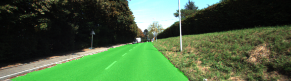
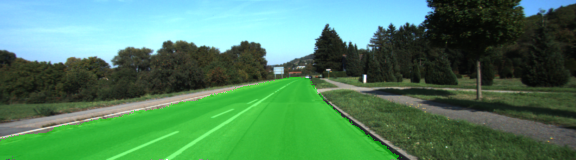
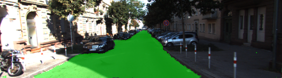

# Semantic Segmentation
### Overview
In this project, we trained a Fully Convolutional Network (FCN) to identify road pixels from images. We started with the VGG16 network and added skip layers, 1x1 convolutions and upsampling to build the FCN.

### Example Output:




### Setup
##### Frameworks and Packages
Make sure you have the following installed:
 - [Python 3](https://www.python.org/)
 - [TensorFlow](https://www.tensorflow.org/)
 - [NumPy](http://www.numpy.org/)
 - [SciPy](https://www.scipy.org/)
##### Dataset
Download the [Kitti Road dataset](http://www.cvlibs.net/datasets/kitti/eval_road.php) from [here](http://www.cvlibs.net/download.php?file=data_road.zip).  Extract the dataset in the `data` folder.  This will create the folder `data_road` with all of the training and test images.

##### Run
Run the following command to train the FCN:
```
python main.py
```

